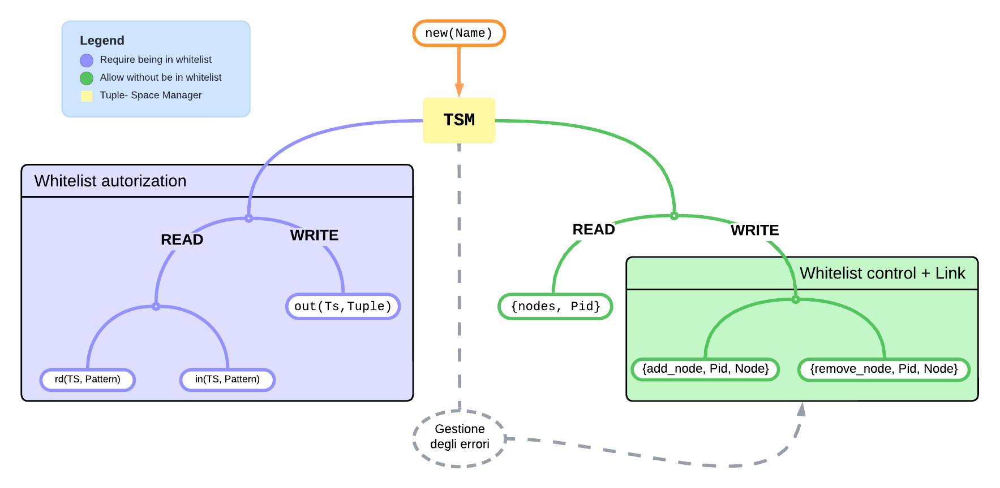
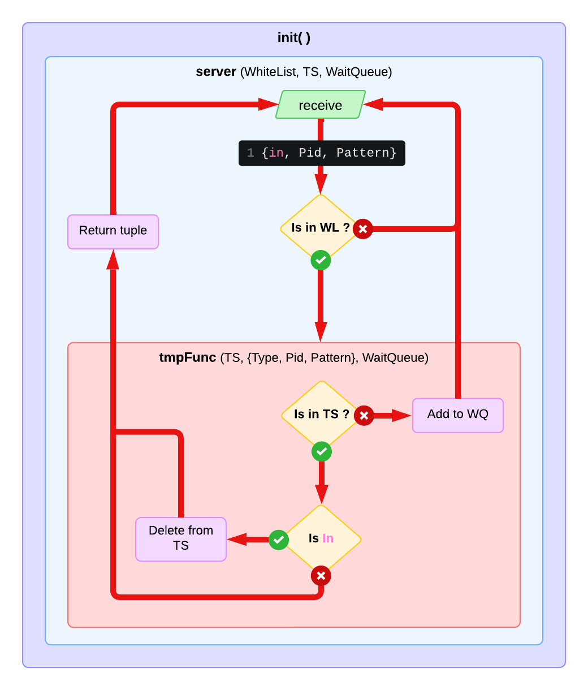

# Erlang - Relazione progetto

## Tuple Space

<a name="readme-top"></a>

 Kania, Nicholas  - <n.kania@campus.uniurb.it> <br>
 Leopizzi, Matteo  - <m.leopizzi1@campus.uniurb.it> <br>
 Pierucci, Giada  - <g.pierucci4@campus.uniurb.it>

<!-- TABELLA DEI CONTENUTI -->
<details>
  <summary>Tabella dei contenuti</summary>
  <ol>
    <li>
      <a href="#descrizione-del-progetto">Descrizione del progetto</a>
    </li>
    <li>
      <a href="#tecnologia">Tecnologia</a>
      <ul>
        <li><a href="#dependances">Dependances</a></li>
        <li><a href="#scelte-implementative">Scelte implementative</a></li>
      </ul>
    </li>
    <li>
      <a href="#stress-test"> StressTest </a>
    </li>
  </ol>
</details>

<!-- DESCRIZIONE DEL PROGETTO -->
## Descrizione del progetto

Il progetto si propone di implementare uno **Spazio di Tuple** (Tuple Space - **TS**), ovvero un'astrazione di memoria condivisa, in cui i vari processi possono interagire mediante condivisione di messaggi (message-passing).

Dal momento in cui si verifica la **creazione** del TS in questione (`new(name)`) e vi si **aggiunge** almeno un nodo (`addNode(TS, Node)`), vi è la possibilità di eseguire due tipologie di operazioni di **lettura** ed una operazione di **scrittura** `out(TS, Tuple)`, la quale ha sempre esito positivo.

Le operazioni di lettura `in(TS, Pattern)` e `rd(TS, Pattern)` sono entrambe **bloccanti** sebbene solo la prima sia distruttiva, ovvero quando la tupla viene letta quest'ultima deve essere eliminata dal TS.
Si precisa che, data la natura bloccante delle operazioni in lettura, si definisce, per ognuna, un'ulteriore versione impostando un **timeout**.
Pertanto, qualora non venga riscontrata una tupla il cui pattern corrispondi a quello richiesto, si rimane in attesa solo fino a quando il periodo indicato non è decorso.

Oltre alle prescritte funzioni, vi è anche la possibilità di procedere alla **rimozione** un nodo precedentemente aggiunto nel TS qualora non fosse più d'interesse (`removeNode(TS, Node)`) e di osservare quali sono i nodi ancora presenti nel TS attraverso `nodes(TS)`.

<p align="right">(<a href="#readme-top">Torna su</a>)</p>

<!-- SCELTE IMPLEMENTATIVE -->
## Scelte implementative

___

<!-- MODULI -->
### MODULI

* Modulo `tss`: Tuple-Space Supervisor.
  Si occupa della supervisione del Tuple-Space Manager (`tsm`) e della sua inizializzazione.
  Nel caso in cui il TS Manager decade lo rispristina.

* Modulo `tsm`: Tuple-Space Manager.

  Si occupa della creazione e gestione di:
  * Tabelle ETS: space (Tuple Space), whitelist (White List).
  * PendingRequestsQueue.
  * Tabella DETS: memorizzazione del Tuple Space su disco.

  Gestisce i messaggi inviati tramite il processo Tuple-Space Client.

* Modulo `ts`: Tuple-Space Client.

  Interfaccia client in cui vengono invocate le varie operazioni che verranno inviate al Tuple-Space Manager.

* Modulo `tstest`: Batteria di Stress Test per qualificare le prestazioni e la resilienza del sistema.

### STRUTTURE DATI

* Due tabelle ETS private, così da non esporre le tabelle ai nodi esterni, con tipologia `set`, dove le chiavi univoche sono i PID dei nodi autorizzati:

  * **whitelist (WL)** : Memorizzazione dei PID che possono accedere al Tuple Space.

  * **space (TS)** : Spazio di tuple. Tabella contenente le tuple inserite dai nodi autorizzati.

* **PendingRequestsQueue** : Lista contenente le operazioni di lettura (`in`, `rd`), in attesa di Pattern Matching.

* Una tabella DETS per il salvaggio periodico del Tupla Space su disco.

### MATCH SPECIFICATION ????

Le operazioni di lettura e struttura devono sottostare ad un certo pattern da seguire per poter inserire un record nel Tuple Space è il seguente:

```erl
{'$1','$2', atomo, '$3'}
% oppure
{'_', '_', atomo, '_'}
```

### FUNZIONI INTERFACCIA CLIENT

* `new(Name)`: crea un nuovo Tuple Space.

* `in(TS, Pattern, Timeout)`: operazione di lettura dal Tuple Space, con eliminazione dell'elemento dalla tabella. Viene passato un valore di Timeout per scartare l'operazione in caso di mancata risposta. Se nel Tuple Space non è presente il Pattern specificato, la richiesta di lettura viene aggiunta alla Wait Queue.

* `in(TS, Pattern)`: stessa funzione precedente, con `Timeout = infinity`.

* `rd(TS, Pattern, Timeout)` : operazione di lettura dal Tuple Space. Viene passato un valore di Timeout per scartare l'operazione in caso di mancata risposta. Se nel Tuple Space non è presente il Pattern specificato, la richiesta di lettura viene aggiunta alla Wait Queue.

* `rd(TS, Pattern)`: stessa funzione precedente, con `Timeout = infinity`.

* `out(TS, Pattern)`: operazione di scrittura sul Tuple Space che, una volta eseguita, effettua un controllo sulla Wait Queue per verificare che ci siano richieste pendenti da poter soddisfare.

* `addNode(TS, Node)`: viene creato un link tra il processo invocante (`ts`) ed il gestore dello spazio di tuple (`tsm`), il quale registrerà il PID dell'invocante all'interno della propria White List.

* `removeNode(TS, Node)`: viene eliminato il link associato al gestore dello spazio di tuple (`tsm`), il nodo viene rimosso dalla White List e vengono eliminate tutte le richieste di `in` o `rd` relative a quel nodo (nella PendingRequestQueue).

* `nodes(TS, Node)`: elenco di tutti gli elementi contenuti nella White List.

<br />
<div align="center">
    
</div>
<br />

---

### FUNZIONI AUSILIARIE

* list ????

* `removeFromWhiteList(WhiteListRef, Pid)`: elimina il nodo della whitelist, quindi il nodo non sarà più autorizzato ad accedere al TupleSpace.

* `removePendingRequests(PendingRequestsQueue, Pid)`: elimina tutte le richieste di `in` o `rd` relative a quel nodo (nella PendingRequestQueue).

* `tryProcessRequest(TupleSpaceRef, {Type, Pid, Pattern}, PendingRequestsQueue)`: controlla se la richesta di `in` o `rd` di uno specifico pattern è presente nel Tuple Space, altrimenti ritorna la richiesta da aggiungere al PendingRequestsQueue.

* `inWhiteList(WhiteListRef, Pid)`: verifica la presenza del nodo nella White List, quindi se il nodo è autorizzato e può accedere al Tuple Space.

* `abortPendingRequests({Type, Pid, Pattern}, PendingRequestsQueue)`:

* `processPendingRequests(TupleSpaceRef, PendingRequestsQueue)`: prova ad eseguire le richieste in attesa, richiamando `tryProcessRequest`. Crea una nuova PendingRequestsQueue contenente tutte le richieste che non è possibile eseguire.

* `addNode(WhiteListRef, Node)`: crea un link tra il nodo e il Tuple Space Manager e inserisce il nodo nella White List, diventato un dono autorizzato.

* `removeNode(WhiteListRef, Node)`: interrompe il link tra il nodo e il Tuple Space Manager e eliminando il nodo dalla White List

* `getNodes(WhiteListRef)`: lista dei nodi autorizzati presenti nella White List.

---

* **TrapExit**: è stato implemenatato per tutelare il Server Tuple Space dalla caduta di un eventuale link non autorizzato.


<br />
<div align="center">
    
</div>
<br />

<p align="right">(<a href="#readme-top">Torna su</a>)</p>

<!-- STRESS TEST -->
## Stress Test Result

<table id = "customers">
<tr>
  <th>Company</th>
  <th>Contact</th>
  <th>Country</th>
</tr>
<tr>
  <td>Company</td>
  <td>Contact</td>
  <td>Country</td>
</tr>
</table>

1. Provare a rimuovere un Ts_actor e vedere se è ancora vivo.

2. Etteffuare una batteria di test per ogni operazione (in, rd, out).

3. Controllo per verificare che le richieste siano state rimosse dalla PendingRequestQueue


## CHIEDERE A NICK

matching specification

tipologia set per il tuple space

addNode in Whitelist 

removeNode tsm

abort pending request

process pending request (WQ)

{in, Pid, Pattern} (tsm receive)
