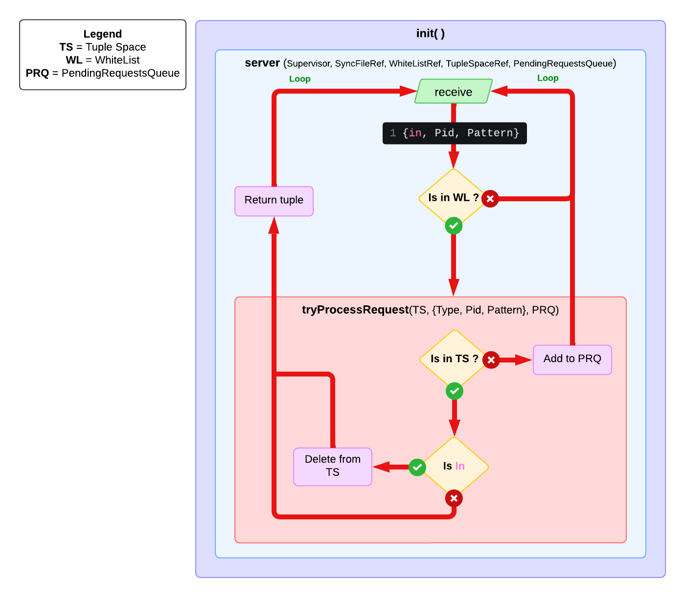

# Erlang - Relazione progetto

## Tuple Space

<a name="readme-top"></a>

 Kania, Nicholas  - <n.kania@campus.uniurb.it> <br>
 Leopizzi, Matteo  - <m.leopizzi1@campus.uniurb.it> <br>
 Pierucci, Giada  - <g.pierucci4@campus.uniurb.it>

<!-- TABELLA DEI CONTENUTI -->
<details>
  <summary>Tabella dei contenuti</summary>
  <ol>
    <li>
      <a href="#descrizione-del-progetto">Descrizione del progetto</a>
    </li>
    <li>
      <a href="#scelte-implementative">Scelte implementative</a>
      <ul>
        <li><a href="#moduli">Moduli</a></li>
        <li><a href="#strutture-dati">Strutture dati</a></li>
        <li>
          <a href="#funzioni">Funzioni</a>
          <ul>
          <li><a href="#client">Client</a></li>
          <li><a href="#server">Server</a></li>
          </ul>
        </li>
        <li><a href="#esempio-di-matching-specification">Esempio di Matching Specification</a></li>
      </ul>
    </li>
    <li>
      <a href="#test"> Test </a>
      <ul>
          <li>
            <a href="#average-function-time-sequenziale">Average Function Time Sequenziale</a>
            <ul>
              <li><a href="#seq-tradizionale">Seq tradizionale</a></li>
              <li><a href="#seq-gen-server">Seq Gen-Server</a></li>
            </ul>
          </li>
          <li>
            <a href="#average-function-time-distribuito">Average Function Time Distribuito</a>
            <ul>
              <li><a href="#dis-tradizionale">Dis tradizionale</a></li>
              <li><a href="#dis-gen-server">Dis Gen-Server</a></li>
            </ul>
          </li>
          <li>
            <a href="#average-node-fail-time">Average Node Fail Time</a>
          </li>
      </ul>
    </li>
  </ol>
</details>

<!-- DESCRIZIONE DEL PROGETTO -->
## Descrizione del progetto

Il progetto si propone di implementare uno **Spazio di Tuple** (Tuple Space - **TS**), ovvero un'astrazione di memoria condivisa, in cui i vari processi possono interagire mediante condivisione di messaggi (message-passing).

Dal momento in cui si verifica la **creazione** del TS in questione (`new(name)`) e vi si **aggiunge** almeno un nodo (`addNode(TS, Node)`), vi è la possibilità di eseguire due tipologie di operazioni di **lettura** ed una operazione di **scrittura** `out(TS, Tuple)`, la quale ha sempre esito positivo.

Le operazioni di lettura `in(TS, Pattern)` e `rd(TS, Pattern)` sono entrambe **bloccanti** sebbene solo la prima sia distruttiva, ovvero quando la tupla viene letta quest'ultima deve essere eliminata dal TS.
Si precisa che, data la natura bloccante delle operazioni in lettura, si definisce, per ognuna, un'ulteriore versione impostando un **timeout**.
Pertanto, qualora non venga riscontrata una tupla il cui pattern corrispondi a quello richiesto, si rimane in attesa solo fino a quando il periodo indicato non è decorso.

Oltre alle prescritte funzioni, vi è anche la possibilità di procedere alla **rimozione** un nodo precedentemente aggiunto nel TS qualora non fosse più d'interesse (`removeNode(TS, Node)`) e di osservare quali sono i nodi ancora presenti nel TS attraverso `nodes(TS)`.

<p align="right">(<a href="#readme-top">Torna su</a>)</p>

<!-- SCELTE IMPLEMENTATIVE -->
## Scelte implementative

* I nodi che decadono non vengono rimpiazzati, solo il processo  manager e il processo supervisore vengono ripristinati.
* Quando il link di un nodo autorizzato nella White List decade, il nodo resta attivo.
* **TrapExit**: è stato implemenatato in fase di inizializzazione del processo manager, per tutelare il Tuple Space dalla caduta di un eventuale link.

<!-- MODULI -->
### MODULI

* Modulo `tss`: Tuple-Space Supervisor.
  Si occupa della supervisione del Tuple-Space Manager (`tsm`) e della sua inizializzazione.
  Nel caso in cui il Tuple-Space Manager decade, lo rispristina.

* Modulo `tsm`: Tuple-Space Manager.

  Funzione di inizializzazione
  * `init(Name, true)`: Crea il processo supervisore per gestire il Tuple Space.
  * `init(Name, Supervisor)`: Inizializzazione del manager escludendo la creazione del processo supervisione. Utilizzato per ripristinare il Tuple Space a partire dallo stesso 

  Si occupa della creazione e gestione di:
  * Tabelle ETS: space (Tuple Space), whitelist (White List).
  * PendingRequestsQueue.
  * Tabella DETS: memorizzazione del Tuple Space su disco.

  Gestisce i messaggi inviati tramite il processo Tuple-Space Client. Nel caso in cui il Tuple-Space Supervicor decade, lo rispristina.

  Sono state implementate due funzioni `init`

* Modulo `ts`: Tuple-Space Client.

  Interfaccia client in cui vengono invocate le varie operazioni che verranno inviate al Tuple-Space Manager.

* Modulo `tstest`: Batteria di Stress Test per qualificare le prestazioni e la resilienza del sistema.

<!-- STRUTTURE DATI -->
### STRUTTURE DATI

* **space (TS)**: Spazio di tuple. Tabella contenente le tuple inserite dai nodi autorizzati. Una tabella DETS per il salvaggio periodico del Tupla Space su disco.

* **whitelist (WL)**: Memorizzazione dei PID dei nodi autorizzati, quelli cioè che possono accedere al Tuple Space. Tabella ETS privata, così da non esporre le tabelle ai nodi esterni, con tipologia `set`, dove le chiavi univoche sono i PID dei nodi autorizzati.

* **PendingRequestsQueue** : Lista contenente le operazioni di lettura (`in`, `rd`), in attesa di Pattern Matching.

<!-- FUNZIONI -->
### FUNZIONI

<!-- CLIENT -->
#### $\to$ CLIENT

* `new(Name)`: crea un nuovo Tuple Space.

* `in(TS, Pattern, Timeout)`: operazione di lettura dal Tuple Space, con eliminazione dell'elemento dalla tabella. Viene passato un valore di Timeout per scartare l'operazione in caso di mancata risposta. Se nel Tuple Space non è presente il Pattern specificato, la richiesta di lettura viene aggiunta alla Wait Queue.

* `in(TS, Pattern)`: stessa funzione precedente, con `Timeout = infinity`.

* `rd(TS, Pattern, Timeout)` : operazione di lettura dal Tuple Space. Viene passato un valore di Timeout per scartare l'operazione in caso di mancata risposta. Se nel Tuple Space non è presente il Pattern specificato, la richiesta di lettura viene aggiunta alla Wait Queue.

* `rd(TS, Pattern)`: stessa funzione precedente, con `Timeout = infinity`.

* `out(TS, Pattern)`: operazione di scrittura sul Tuple Space che, una volta eseguita, effettua un controllo sulla Wait Queue per verificare che ci siano richieste pendenti da poter soddisfare.

* `addNode(TS, Node)`: viene creato un link tra il processo invocante (`ts`) ed il gestore dello spazio di tuple (`tsm`), il quale registrerà il PID dell'invocante all'interno della propria White List.

* `removeNode(TS, Node)`: viene eliminato il link associato al gestore dello spazio di tuple (`tsm`), il nodo viene rimosso dalla White List e vengono eliminate tutte le richieste di `in` o `rd` relative a quel nodo (nella PendingRequestQueue).

* `nodes(TS, Node)`: elenco di tutti gli elementi contenuti nella White List.

<br />
<div align="center">
    
</div>
<br />

<!-- SERVER -->
#### $\to$ SERVER

* `removeFromWhiteList(WhiteListRef, Pid)`: elimina il nodo della whitelist, quindi il nodo non sarà più autorizzato ad accedere al TupleSpace.

* `tryProcessRequest(TupleSpaceRef, {Type, Pid, Pattern}, PendingRequestsQueue)`: controlla se la richesta di `in` o `rd` di uno specifico pattern è presente nel Tuple Space, altrimenti ritorna la richiesta da aggiungere al PendingRequestsQueue.

* `inWhiteList(WhiteListRef, Pid)`: verifica la presenza del nodo nella White List, quindi se il nodo è autorizzato e può accedere al Tuple Space.

* `removePendingRequests(PendingRequestsQueue, Pid)`: rimuove tutte le richieste di `in` o `rd` relative a quel nodo (nella PendingRequestQueue).

* `abortPendingRequests({Type, Pid, Pattern}, PendingRequestsQueue)`: rimuove dalla PendingRequestQueue tutte le richieste di `in` o `rd` che coincidono con la tupla ({Type, Pid, Pattern}) passata.

* `processPendingRequests(TupleSpaceRef, PendingRequestsQueue)`: prova ad eseguire le richieste in attesa, richiamando `tryProcessRequest`. Crea una nuova PendingRequestsQueue contenente tutte le richieste che non è possibile eseguire.

* `addNode(WhiteListRef, Node)`: crea un link tra il nodo e il Tuple Space Manager e inserisce il nodo nella White List, diventato un dono autorizzato.

* `removeNode(WhiteListRef, Node)`: interrompe il link tra il nodo e il Tuple Space Manager e eliminando il nodo dalla White List

* `getNodes(WhiteListRef)`: lista dei nodi autorizzati presenti nella White List.

<!-- ESEMPIO DI MATCHING SPECIFICATION -->
### Esempio di Matching Specification

<br />
<div align="center">
    
</div>
<br />

<p align="right">(<a href="#readme-top">Torna su</a>)</p>

<!-- TEST -->
## TEST

<!-- AVERAGE FUNCTION TIME SEQUENZIALE-->
### Average Function Time Sequenziale

  ``` erl
  (nodo1@Matteo)13> spawn(node(), tstest, testBattery_IO_seq, [myTS, 100]).
  Avg time (OUT): 9.118811881188119 us
  Avg time (RD): 15.207920792079207 us
  Avg time (IN): 20.277227722772277 us
  ok
  ```

<!-- SEQ TRADIZIONALE -->
#### Seq Tradizionale

  <table>
    <tr>
      <th>Num. tuple</th>
      <th>OUT (us)</th>
      <th>RD (us)</th>
      <th>IN (us)</th>
    </tr>
    <tr>
      <td>100</td>
      <td>9.119</td>
      <td>15.208</td>
      <td>20.277</td>
    </tr>
    <tr>
      <td>1000</td>
      <td>3.887</td>
      <td>20.561</td>
      <td>22.402</td>
    </tr>
    <tr>
      <td>100000</td>
      <td>2.912</td>
      <td>18.592</td>
      <td>21.889</td>
    </tr>
  </table>

<!-- SEQ GEN-SERVER -->
#### Seq Gen-server

  <table>
    <tr>
      <th>Num. tuple</th>
      <th>OUT (us)</th>
      <th>RD (us)</th>
      <th>IN (us)</th>
    </tr>
    <tr>
      <td>100</td>
      <td>9.119</td>
      <td>14.198</td>
      <td>19.257</td>
    </tr>
    <tr>
      <td>1000</td>
      <td>6.037</td>
      <td>49.408</td>
      <td>35.702</td>
    </tr>
    <tr>
      <td>100000</td>
      <td>3.009</td>
      <td>18.572</td>
      <td>17.991</td>
    </tr>
  </table>

<!-- AVERAGE FUNCTION TIME DISTRIBUITO -->
### Average Function Time Distribuito

  ``` erl
  (nodo2@Matteo)14> spawn(node(), tstest, testBattery_IO_conc, [myTS, 1000]).
  <0.141.0>
  Avg time (OUT): 6.444555444555444 us
  Debug print - REMOVE NODE (<0.142.0>)
  Avg time (IN): 58.61738261738262 us
  Debug print - REMOVE NODE (<0.143.0>)
  ```

<!-- DIS TRADIZIONALE -->
#### Dis Tradizionale

  <table>
    <tr>
      <th>Num. tuple</th>
      <th>OUT (us)</th>
      <th>IN (us)</th>
    </tr>
      <tr>
      <td>100</td>
      <td>37.273</td>
      <td>139.636</td>
    </tr>    
    <tr>
      <td>1000</td>
      <td>6.444</td>
      <td>58.617</td>
    </tr>
    <tr>
      <td>100000</td>
      <td>3.144</td>
      <td>42.820</td>
    </tr>
  </table>

<!-- DIS GEN-SERVER -->
#### Dis Gen-server

  <table>
    <tr>
      <th>Num. tuple</th>
      <th>OUT (us)</th>
      <th>IN (us)</th>
    </tr>
    <tr>
      <td>100</td>
      <td>5.069</td>
      <td>30.416</td>
    </tr>
    <tr>
      <td>1000</td>
      <td>3.785</td>
      <td>47.260</td>
    </tr>
    <tr>
      <td>100000</td>
      <td>2.795</td>
      <td>26.432</td>
    </tr>
  </table>

<!-- AVERAGE NODE FAIL TIME -->
### Average Node Fail Time

#### Tradizionale

  <table>
    <tr>
      <th>Num. times</th>
      <th>Avg (us)</th>
    </tr>
    <tr>
      <td>10</td>
      <td>684.170</td>
    </tr>
     <tr>
      <td>100</td>
      <td>6296.089</td>
    </tr>
    <tr>
      <td>1000</td>
      <td> 6524.850</td>
    </tr>

  </table>

## CHIEDERE A NICK

* addNode in Whitelist -> quando un nodo inviato un messaggio sbagliato ( tipo ts:nodes() ), il ts si cancella.

* list (tsm) -> okpatato come risposta

* process pending request (tsm) -> WQ

* che cosa dire del gen server e come è stato implementato

* quando converto il markdown in pdf sia la tabel of content, sia le immagini non ci sono. Possiamo esportarlo senza.

Baci baci e buon rientro a casa <3
